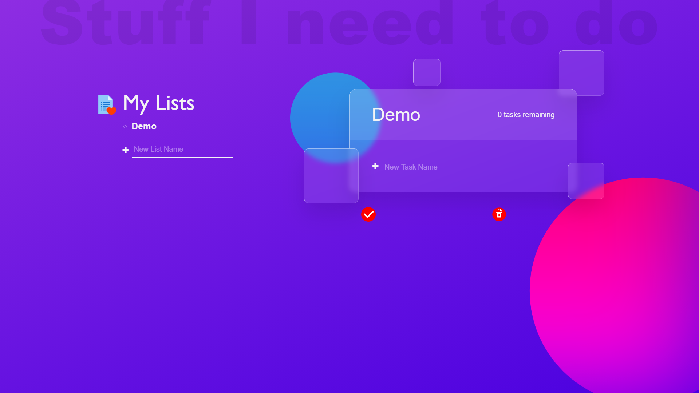

# To-do_App

Website : https://debrajhyper.github.io/To-do_App/

    A web app to manage your daily tasks. 📑
    
    * Infinitely flexible 📝
    * Incredibly easy to use 🧡
    * A responsive Web app 📅

    This To-do website keeps track of everything, from the big picture to the minute details.

# Website Info
Designed by <a href="https://github.com/debrajhyper">Debraj Karmakar</a>

Technology Used :

* HTML5
* CSS3
* Bootstrap
* jQuery
* JavaScript
* Github
* VS Code
* Bootstrap Studio
* Chrome

<h3>New List</h3>

    
<h3>New Task</h3>

